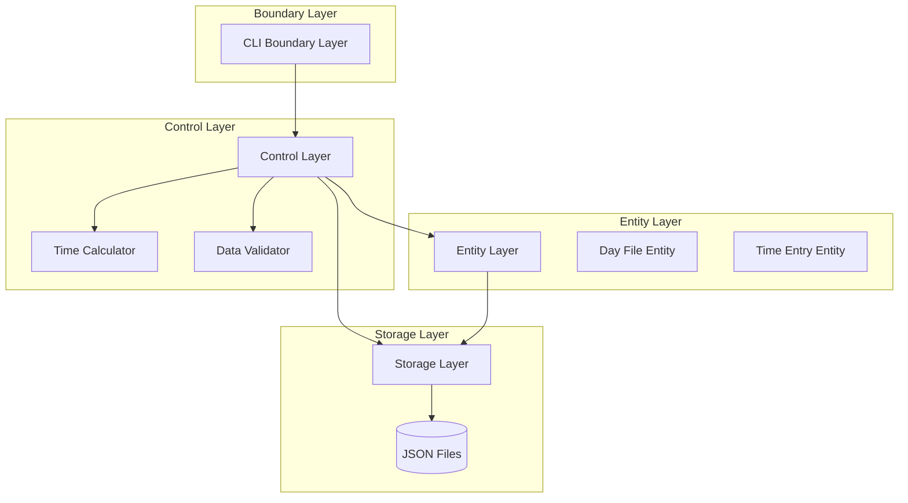
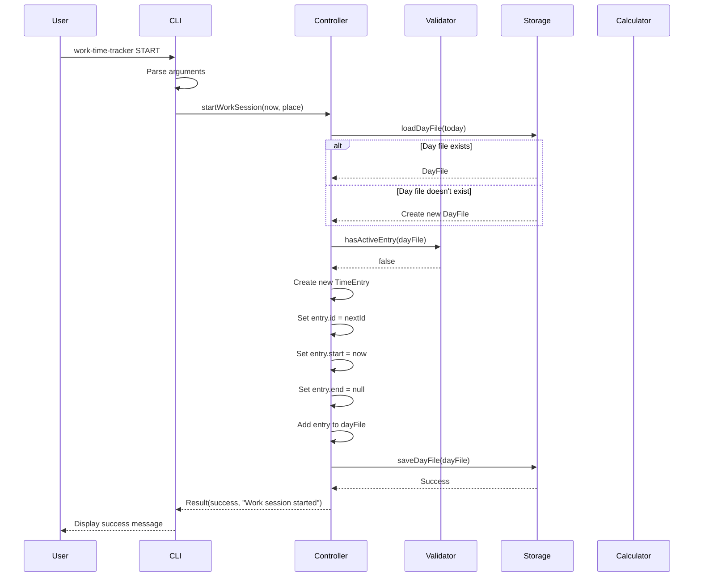
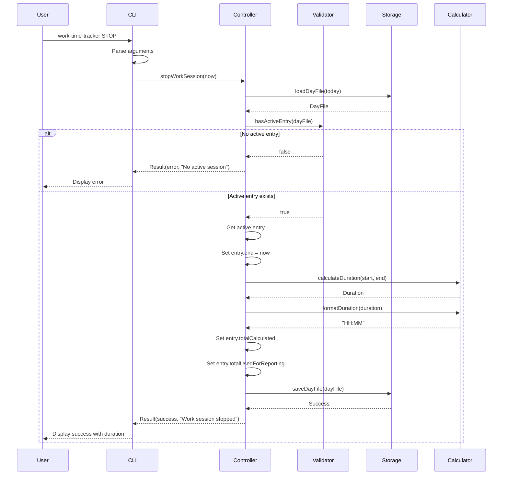

# Design Document: Work Time Tracker

## Overview

The Work Time Tracker is a Java-based CLI application that enables users to track their work hours by recording start and stop timestamps throughout the day. The system supports multiple work sessions per day to accommodate breaks and interruptions, storing data in JSON files organized by date. Built using the BCE (Boundary-Control-Entity) architectural pattern, the system provides a simple command-line interface for time tracking operations while maintaining data persistence in a structured JSON format compatible with future web interface integration.

## Architecture

The system follows the BCE (Boundary-Control-Entity) pattern, separating concerns into three distinct layers:



### Layer Responsibilities

**Boundary Layer (CLI)**:
- Parses command-line arguments
- Validates user input format
- Displays results and error messages to user
- Delegates business logic to Control Layer

**Control Layer**:
- Orchestrates time tracking operations (START, STOP)
- Coordinates between Boundary and Entity layers
- Implements business rules and validation logic
- Calculates time durations and totals

**Entity Layer**:
- Represents domain objects (DayFile, TimeEntry)
- Encapsulates data structure and validation rules
- Provides object-oriented interface to data

**Storage Layer**:
- Handles JSON file I/O operations
- Manages file naming conventions (yyyy-MM-dd.json)
- Serializes/deserializes entities using Jackson

## Components and Interfaces

### Component 1: CLI Boundary

**Purpose**: Provides command-line interface for user interactions

**Interface**:
```java
interface CommandLineInterface {
    void execute(String[] args);
    void displaySuccess(String message);
    void displayError(String message);
}
```

**Responsibilities**:
- Parse command-line arguments (START, STOP, etc.)
- Validate command syntax
- Display formatted output to console
- Handle user-facing error messages

### Component 2: Time Tracking Controller

**Purpose**: Orchestrates time tracking business logic

**Interface**:
```java
interface TimeTrackingController {
    Result startWorkSession(LocalDateTime timestamp, WorkPlace place);
    Result stopWorkSession(LocalDateTime timestamp);
    DayFile getCurrentDayFile(LocalDate date);
    TimeEntry getActiveEntry(LocalDate date);
}
```

**Responsibilities**:
- Create new time entries with START command
- Complete time entries with STOP command
- Calculate durations between start and stop times
- Validate business rules (no overlapping entries, active session exists)
- Coordinate with Storage Layer for persistence

### Component 3: Time Calculator

**Purpose**: Performs time-related calculations

**Interface**:
```java
interface TimeCalculator {
    Duration calculateDuration(LocalDateTime start, LocalDateTime end);
    String formatDuration(Duration duration);
    Duration parseDuration(String durationString);
    Duration sumDurations(List<Duration> durations);
}
```

**Responsibilities**:
- Calculate time differences between timestamps
- Format durations as HH:MM strings
- Parse HH:MM strings to Duration objects
- Sum multiple durations for daily totals

### Component 4: Data Validator

**Purpose**: Validates data integrity and business rules

**Interface**:
```java
interface DataValidator {
    ValidationResult validateTimeEntry(TimeEntry entry);
    ValidationResult validateDayFile(DayFile dayFile);
    boolean hasActiveEntry(DayFile dayFile);
    boolean hasOverlappingEntries(DayFile dayFile, TimeEntry newEntry);
}
```

**Responsibilities**:
- Validate time entry completeness and consistency
- Check for overlapping time entries
- Verify data conforms to JSON schema
- Enforce business rules

### Component 5: Storage Manager

**Purpose**: Manages JSON file persistence

**Interface**:
```java
interface StorageManager {
    DayFile loadDayFile(LocalDate date) throws IOException;
    void saveDayFile(DayFile dayFile) throws IOException;
    boolean dayFileExists(LocalDate date);
    String getFilePath(LocalDate date);
}
```

**Responsibilities**:
- Load day files from JSON
- Save day files to JSON
- Handle file naming conventions (yyyy-MM-dd.json)
- Manage Jackson serialization/deserialization
- Handle file system errors gracefully

## Data Models

### Model 1: DayFile

```java
class DayFile {
    List<TimeEntry> entries;
    String pensum;           // Format: HH:MM
    DayType dayType;
    
    // Derived methods
    int getNextEntryId();
    TimeEntry getActiveEntry();
    Duration getTotalWorkedTime();
}
```

**Validation Rules**:
- `pensum` must match pattern `^\d{2}:\d{2}$`
- `dayType` must be one of: PUBLIC_HOLIDAY, REGULAR, SICK_LEAVE, TIME_OFF, VACATION, VACATION_FOR_SATURDAY_HOLIDAY, WEEKEND
- `entries` list can be empty but not null
- Entry IDs must be unique within the day file
- No overlapping time entries allowed

### Model 2: TimeEntry

```java
class TimeEntry {
    int id;
    LocalDateTime start;
    LocalDateTime end;              // null if entry is active
    String totalCalculated;         // Format: HH:MM
    String totalUsedForReporting;   // Format: HH:MM
    WorkPlace place;
    String paidOverhours;           // Format: HH:MM
}
```

**Validation Rules**:
- `id` must be >= 0
- `start` must be non-null
- `end` must be after `start` (when not null)
- `start` and `end` must be on the same calendar day
- `totalCalculated` must match pattern `^\d{2}:\d{2}$`
- `totalUsedForReporting` must match pattern `^\d{2}:\d{2}$`
- `place` must be one of: OFFICE, HOME, CLIENT
- `paidOverhours` must match pattern `^\d{2}:\d{2}$`

### Model 3: Enumerations

```java
enum DayType {
    PUBLIC_HOLIDAY,
    REGULAR,
    SICK_LEAVE,
    TIME_OFF,
    VACATION,
    VACATION_FOR_SATURDAY_HOLIDAY,
    WEEKEND
}

enum WorkPlace {
    OFFICE,
    HOME,
    CLIENT
}
```

### Model 4: Result Types

```java
class Result {
    boolean success;
    String message;
    Object data;
}

class ValidationResult {
    boolean valid;
    List<String> errors;
}
```

## Sequence Diagrams

### START Command Flow



### STOP Command Flow



## Error Handling

### Error Scenario 1: START Command with Active Session

**Condition**: User executes START command when there's already an active (unclosed) time entry for the current day

**Response**: 
- System detects active entry through Validator
- Returns error result with message: "Cannot start new session: active session already exists"
- Does not modify existing data

**Recovery**: 
- User must execute STOP command first to close active session
- Then user can execute START command again

### Error Scenario 2: STOP Command with No Active Session

**Condition**: User executes STOP command when there's no active time entry for the current day

**Response**:
- System detects no active entry through Validator
- Returns error result with message: "Cannot stop session: no active session found"
- Does not modify existing data

**Recovery**:
- User must execute START command first to begin a session
- System provides helpful message indicating START is required

### Error Scenario 3: File I/O Errors

**Condition**: System cannot read or write JSON files due to permissions, disk space, or corruption

**Response**:
- Storage layer catches IOException
- Wraps exception with user-friendly message
- Returns error result with message: "Failed to access time tracking data: [reason]"
- Logs technical details for debugging

**Recovery**:
- User checks file permissions on data directory
- User verifies disk space availability
- System attempts operation again on next command
- Data integrity maintained (no partial writes)

### Error Scenario 4: Invalid JSON Data

**Condition**: Existing JSON file is corrupted or doesn't match schema

**Response**:
- Jackson parser throws exception during deserialization
- Storage layer catches and wraps exception
- Returns error result with message: "Data file corrupted for [date]"
- Suggests manual inspection or restoration from backup

**Recovery**:
- User manually inspects JSON file
- User corrects JSON syntax errors
- User restores from backup if available
- System validates repaired file on next load

### Error Scenario 5: Invalid Command Arguments

**Condition**: User provides unrecognized command or invalid arguments

**Response**:
- CLI boundary validates command syntax
- Returns error with usage information
- Message: "Invalid command. Usage: work-time-tracker [START|STOP]"

**Recovery**:
- User reviews usage information
- User executes command with correct syntax

## Correctness Properties

*A property is a characteristic or behavior that should hold true across all valid executions of a system—essentially, a formal statement about what the system should do. Properties serve as the bridge between human-readable specifications and machine-verifiable correctness guarantees.*

### Property 1: START Command Creates Valid Active Entry

For any timestamp and workplace, executing the START command should create a new Time_Entry with that timestamp as the start time, a null end timestamp, a unique sequential ID, and persist it to the Day_File.

**Validates: Requirements 1.1, 1.2, 1.3, 1.4**

### Property 2: START Command Rejects When Active Entry Exists

For any Day_File with an active entry (end timestamp is null), attempting to execute START should be rejected with an error message, and the Day_File should remain unchanged.

**Validates: Requirements 1.5, 6.4**

### Property 3: STOP Command Completes Active Entry

For any Day_File with an active entry, executing the STOP command should set the end timestamp to the current time, calculate the duration between start and end, store it in HH:MM format in both totalCalculated and totalUsedForReporting fields, and persist the updated entry.

**Validates: Requirements 2.1, 2.2, 2.3, 2.4, 5.1, 5.2, 5.3, 5.4**

### Property 4: STOP Command Rejects When No Active Entry

For any Day_File without an active entry, attempting to execute STOP should be rejected with an error message, and the Day_File should remain unchanged.

**Validates: Requirements 2.5**

### Property 5: Multiple Sessions Create Separate Entries

For any sequence of N complete START/STOP cycles, the Day_File should contain N separate Time_Entry objects with sequential IDs starting from 0.

**Validates: Requirements 3.1, 3.2, 3.3**

### Property 6: No Overlapping Time Entries

For any Day_File, no two time entries can have overlapping time ranges. For all pairs of entries e1 and e2, either e1 ends before e2 starts, or e2 ends before e1 starts.

**Validates: Requirements 3.4, 6.3**

### Property 7: File Naming Convention

For any date, the Storage_Manager should name the file using the format yyyy-MM-dd.json.

**Validates: Requirements 4.2**

### Property 8: Persistence and Loading

For any Time_Entry operation (create or modify), the entry should be persisted immediately, and when the system starts, it should load the existing Day_File for the current date if it exists, or create a new empty Day_File if it doesn't.

**Validates: Requirements 4.1, 4.4, 4.5**

### Property 9: Duration Calculation with Minute Precision

For any two timestamps where end is after start, the Time_Calculator should compute the duration as the difference between them, formatted as HH:MM with minute-level precision.

**Validates: Requirements 5.5**

### Property 10: End Timestamp After Start

For any Time_Entry with an end timestamp, the Data_Validator should verify that the end timestamp is strictly after the start timestamp.

**Validates: Requirements 6.1**

### Property 11: Same-Day Constraint

For any Time_Entry in a Day_File, the Data_Validator should verify that all timestamps belong to the same calendar day as the Day_File date.

**Validates: Requirements 6.2**

### Property 12: Entry ID Uniqueness

For any Day_File, the Data_Validator should verify that all Time_Entry IDs are unique within that Day_File.

**Validates: Requirements 3.2, 6.5**

### Property 13: Error Messages Are User-Friendly

For any file I/O error, JSON corruption, or business rule violation, the System should display a user-friendly error message without exposing system details, and maintain data integrity by preventing partial writes.

**Validates: Requirements 8.1, 8.2, 8.3, 8.5**

### Property 14: JSON Serialization Round-Trip

For any valid Day_File object, serializing to JSON and then deserializing should produce an equivalent object with all fields preserved (entries, pensum, dayType, and all Time_Entry fields: id, start, end, totalCalculated, totalUsedForReporting, place, paidOverhours).

**Validates: Requirements 9.1, 9.2, 9.3, 9.4, 10.3**

### Property 15: ISO-8601 Timestamp Format

For any timestamp serialized to JSON, the Storage_Manager should use ISO-8601 format.

**Validates: Requirements 9.5**

### Property 16: HH:MM Format Validation

For any string representing a time duration or pensum or paidOverhours, the System should validate that it matches the pattern ^\d{2}:\d{2}$ and supports values from 00:00 to 23:59.

**Validates: Requirements 14.2, 14.5, 15.2, 15.5**

## Testing Strategy

### Unit Testing Approach

**Test Coverage Goals**: Minimum 80% code coverage, 100% coverage for business logic in Control Layer

**Key Test Cases**:

1. **TimeCalculator Tests**:
   - Calculate duration between two timestamps
   - Format duration as HH:MM string
   - Parse HH:MM string to Duration
   - Sum multiple durations
   - Handle edge cases (midnight crossing, same timestamp)

2. **DataValidator Tests**:
   - Validate complete time entry
   - Detect overlapping entries
   - Identify active entries
   - Validate day file structure
   - Reject invalid data formats

3. **TimeTrackingController Tests**:
   - Start work session successfully
   - Reject START when active session exists
   - Stop work session successfully
   - Reject STOP when no active session
   - Calculate durations correctly
   - Assign sequential entry IDs

4. **Entity Tests**:
   - TimeEntry validation rules
   - DayFile validation rules
   - Enum value constraints
   - Derived method calculations

### Property-Based Testing Approach

**Property Test Library**: JUnit QuickCheck (Java property-based testing library)

**Properties to Test**:

1. **Duration Calculation Commutativity**:
   - Property: For any two timestamps t1 and t2 where t2 > t1, calculating duration(t1, t2) and then formatting and parsing should yield the same duration
   - Generator: Random LocalDateTime pairs with t2 > t1
   - Assertion: `parseDuration(formatDuration(calculateDuration(t1, t2))) == calculateDuration(t1, t2)`

2. **Entry ID Uniqueness**:
   - Property: Adding N entries to a day file should result in N unique IDs
   - Generator: Random number of time entries (1-100)
   - Assertion: `dayFile.entries.stream().map(e -> e.id).distinct().count() == dayFile.entries.size()`

3. **No Overlapping Entries**:
   - Property: For any valid day file, no two entries should overlap
   - Generator: Random day files with multiple entries
   - Assertion: For all pairs of entries, verify non-overlapping constraint

4. **Serialization Round-Trip**:
   - Property: Serializing and deserializing a day file should produce equivalent object
   - Generator: Random valid DayFile objects
   - Assertion: `deserialize(serialize(dayFile)).equals(dayFile)`

5. **Time Entry Consistency**:
   - Property: For any time entry with end timestamp, end must be after start
   - Generator: Random TimeEntry objects
   - Assertion: `entry.end == null || entry.end.isAfter(entry.start)`

### Integration Testing Approach

**Test Scenarios**:

1. **End-to-End START/STOP Flow**:
   - Execute START command
   - Verify JSON file created with correct structure
   - Execute STOP command
   - Verify JSON file updated with end timestamp and duration
   - Validate file contents match schema

2. **Multiple Sessions Per Day**:
   - Execute START command (session 1)
   - Execute STOP command (session 1)
   - Execute START command (session 2)
   - Execute STOP command (session 2)
   - Verify day file contains two complete entries with sequential IDs

3. **File Persistence Across Commands**:
   - Execute START command
   - Restart application (simulate)
   - Execute STOP command
   - Verify system correctly loads existing active entry and completes it

4. **Error Recovery**:
   - Create corrupted JSON file
   - Execute command
   - Verify graceful error handling
   - Fix JSON file
   - Verify system recovers and operates normally

## Performance Considerations

**File I/O Optimization**:
- Day files are small (typically < 10KB), so performance impact is minimal
- Use buffered I/O for file operations
- Consider caching current day file in memory to avoid repeated disk reads
- Lazy load day files only when needed

**Memory Management**:
- Only load single day file at a time (current day)
- No need to load historical data for basic START/STOP operations
- Keep entity objects lightweight
- Use Jackson streaming API for large files (future consideration)

**Response Time Goals**:
- START command: < 100ms
- STOP command: < 100ms
- File load/save: < 50ms
- Total CLI execution: < 200ms

**Scalability Considerations**:
- Current design handles years of data (365 files per year)
- File system can handle thousands of files efficiently
- Future optimization: archive old files to subdirectories by year/month
- No database required for current scale

## Security Considerations

**File System Security**:
- Store JSON files in user's home directory with restricted permissions (600)
- Validate file paths to prevent directory traversal attacks
- Use secure file creation (atomic writes with temp files)

**Input Validation**:
- Sanitize all command-line arguments
- Validate date formats to prevent injection
- Limit string lengths to prevent buffer issues
- Reject special characters in file paths

**Data Integrity**:
- Use atomic file writes (write to temp, then rename)
- Validate JSON schema before saving
- Create backup before overwriting existing files
- Log all data modifications for audit trail

**Error Information Disclosure**:
- Avoid exposing file system paths in error messages
- Log detailed errors to file, show generic messages to user
- Don't reveal system information in stack traces

## Dependencies

**Core Dependencies**:
- Java 25 (JDK)
- Maven 3.9+ (build management)
- Jackson Databind 2.15+ (JSON serialization/deserialization)
- Jackson Datatype JSR310 (Java 8 date/time support)

**Testing Dependencies**:
- JUnit 5 (unit testing framework)
- JUnit QuickCheck (property-based testing)
- Mockito (mocking framework)
- AssertJ (fluent assertions)

**Build Tools**:
- Maven Compiler Plugin (Java 25 support)
- Maven Surefire Plugin (test execution)
- Maven Shade Plugin (executable JAR creation)

**Optional Dependencies**:
- SLF4J + Logback (logging framework)
- Picocli (CLI argument parsing - alternative to manual parsing)

**External Resources**:
- None (fully offline capable)
- No network connectivity required
- No external APIs or services
